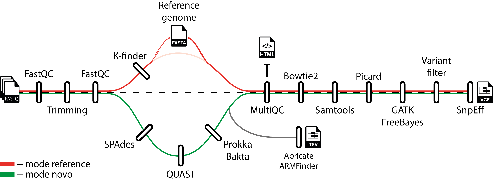

# WGS-Analysis-VariantCalling
[![Contributors][contributors-shield]][contributors-url]
[![Forks][forks-shield]][forks-url]
[![Stargazers][stars-shield]][stars-url]
[![Issues][issues-shield]][issues-url]
[![license-shield]][license-url]

## Introduction
This repository contains Nextflow-based pipeline for whole-genome sequencing (WGS) analysis and genetic variant calling, specifically optimized for **Illumina sequencing** data from bacterial genomes. It is designed to provide an automated, reproducible, and scalable solution for processing large-scale genomic data in clinical microbiology research.





## Contents
- [Pipeline summary](#pipeline-summary)
    - [Refence genome](#mode---reference-and---novo)
    - [*De-novo*](#mode---reference-and---novo)
    - [Assemble](#mode---assemble)
- [Installation](#installation)
- [Usage](#usage)
    - [Parameters](#parameters)
- [References](#reference)


## Pipeline summary:

All modes in the pipeline includes the following steps:

1. **Quality Control**: Quality of raw sequencing data is assessed using [FastQC](https://www.bioinformatics.babraham.ac.uk/projects/fastqc/). Low-quality bases and adapter sequences are removed with [FastP](https://github.com/OpenGene/fastp), followed by another round of [FastQC](https://www.bioinformatics.babraham.ac.uk/projects/fastqc/).

    *  At this stage, the pipeline offers two modes that differ based on the input reference genome. Variant calling can be performed using either a [*de novo*](#de-novo) assembled reference strain or an existing [reference genome](#reference-genome). In the *de novo*, preliminary steps are performed to assemble the desired reference genome:

        *  **Assembly**: Following quality control, *de novo* assembly is performed using [SPAdes](https://github.com/ablab/spades).
        * **Genome QC**: Structural quality metrics are evaluated with [QUAST](https://bioinf.spbau.ru/quast), while genome completeness is assessed using [BUSCO](https://busco.ezlab.org/).
        *   **Annotation**: Genome annotation is carried out with [Prokka](https://github.com/tseemann/prokka) and [Bakta](https://github.com/oschwengers/bakta).


#### mode --reference and --novo
> ***Reference and De-novo***    
>After the reference genome is provided (*de novo* or an exisiting reference), the pipeline follows the same steps for both modes:
>
>    2. **Aggregation of quality reports**: A summary report is genereated with [MultiQC](https://github.com/MultiQC/MultiQC), incorporating the various FastQC reports and, depending on the mode, the QUAST genome quality report.
>    3. **Alignment**: Reads are aligned against the selected reference genome with [BWA-MEM](https://github.com/bwa-mem2/bwa-mem2), followed by processing with [Samtools](https://github.com/samtools/samtools).
>    4. **Variant calling and filtering**: Multiple steps are designed to identify, filter and annotate variants.
>        * **Variant Identification**: Detection of single nucleotide polymorphisms (SNPs) and insertions/deletions (indels) using [PicardTools](https://broadinstitute.github.io/picard/), [GATK](https://github.com/broadinstitute/gatk) and/or [FreeBayes](https://github.com/freebayes/freebayes).
>        *  **Variant Filtering**: Filters are applied to obtain high-confidence variant calls ([*see Parameters*](#parameters)).
>        *  **Genetic variant annotation**: The toolbox [SnpEff](http://pcingola.github.io/SnpEff/) is used to annotate and predict the functional effects of genetic variants on genes and proteins.
>    7. **Post-assembly Analyses**: 
>        * Mass screening of contigs for antimicrobial resistance or virulence genes using [ABRIcate](https://github.com/tseemann/abricate).
>        *  Identification of antimicrobial resistance genes and point mutations in protein and/or assembled nucleotide sequences using [AMRFinder](https://github.com/ncbi/amr).

#### mode --assemble

> ***Assemble***    
>For the --mode assemble, a simplifies pipeline is performed:
>
>    2. **Post-assembly Analyses**: 
>        * Mass screening of contigs for antimicrobial resistance or virulence genes using [ABRIcate](https://github.com/tseemann/abricate).
>        *  Identification of antimicrobial resistance genes and point mutations in protein and/or assembled nucleotide sequences using [AMRFinder](https://github.com/ncbi/amr).
>       * MLST analysis: [ARIBA]() performs a fast MLST analysis, using the raw fastq data and [MLST]() a slow MLST analysis using the genome assembly. 
>       * *Staphylococcus aureus*: In case --mrsa is true, the [spaTyper]() and [sccmec]() software analysis are performed.

 > [!NOTE] 
 The pipeline includes an script to download the reads from DB using an Acc_List.txt<br>
    ```
    bash ./workflow/bin/download_reads.sh
    ```
   


## Installation
Prerequisites to run the pipeline:
- Install [Nextflow](https://github.com/nextflow-io/nextflow).
- Install [Docker](https://github.com/docker/docker-install) or [Singularity](https://github.com/sylabs/singularity-admindocs/blob/main/installation.rst) for container support.
- Ensure [Java 8](https://github.com/winterbe/java8-tutorial) or a later version is installed.

Clone the Repository:

```
# Clone the workflow repository
git clone https://github.com/AMRmicrobiology/WGS-Analysis-VariantCalling.git

# Move inside the main directory
cd WGS-Analysis-VariantCalling
```
<!-- compl -->
### Local (conda)
To create a local conda environment type the following commands:
  ```
  conda create -n WGS -f enviromentWGS.yaml
  conda activate WGS
  ```

## Usage

Run the pipeline using the following commands, adjusting the parameters as needed:

*ASSEMBLE*
```
nextflow run main.nf --mode assemble --input "/path/to/data/*_{1,2}.fastq.gz" --mrsa <true> -profile <docker/singularity/conda>
```

*REFERENCE GENOME*
```
nextflow run main.nf --mode reference --input "/path/to/data/*_{1,2}.fastq.gz" --personal_ref "/path/to/bacterial_genome.fasta" -profile <docker/singularity/conda>
```

*DE NOVO*

```
nextflow run main.nf --mode novo --input "/path/to/data/*_{1,2}.fastq.gz" --wildtype_code "Pa01WT" --genome_name_db ¨Acinetobacter_baumanii_clinical¨ -profile <docker/singularity/conda>
```


### Parameters
```bash
╭─ Required Options ───────────────────────────────────────────────────────────────────────────────╮
│--mode     TEXT    Selection of the pipeline assemble/reference/novo [required]
│--input    TEXT    Input FASTQ paired-end files generated by Illumina (.fastq.gz format) [required]
│--outdir   PATH    Directory where the results will be stored (default: out).
|--mrsa     TEXT    (only for --mode assemble): Specific for *Staphylococcus aureus* genome asseblies. It performs the spaTyper and sccmec software analysis (dafault: false).

--genome_name_db (only for --mode novo): Name of the organism that will name the database in SnpEFF.

--wildtype_code (only for --mode novo): Defines the sample that will be taken as reference.

--personal_ref (only for --mode reference): Path to the bacterial reference genome FASTA file.

-profile: Specifies the execution profile (docker, singularity or conda).

-w: Path to the temporary work directory where files will be stored (default: ./work).
```

#### Optional parameters
##### Trimming

--cut_front: move a sliding window from front (5') to tail, drop the bases in the window if its mean quality < threshold, stop otherwise. Default: 15

--cut_tail: move a sliding window from tail (3') to front, drop the bases in the window if its mean quality < threshold, stop otherwise. Default: 20

--cut_mean_quality: the mean quality requirement option shared by cut_front, cut_tail or cut_sliding. Range: 1~36 default: 20

--length_required: reads shorter than length_required will be discarded. Default: 50.

##### Filter

--qual_snp: One or more expressions used with INFO fields to quality filter SNPs. Default "QUAL < 50.0 || MQ < 25.0 || DP < 30".

--qual_indel: One or more expressions used with INFO fields to quality filter INDELs. Default: "QUAL < 200.0 || MQ < 25.0 || DP < 30".

>[!NOTE]
QUAL: A confidence measure of the variant; MQ: Mapping quality; DP: Filtered reads that support each of the reported alleles (depth). More info [here](https://gatk.broadinstitute.org/hc/en-us/articles/360035890471-Hard-filtering-germline-short-variants).


## Reference:

[In Silico Evaluation of Variant Calling Methods for Bacterial Whole-Genome Sequencing Assays](https://www.ncbi.nlm.nih.gov/pmc/articles/PMC10446864/)

[Recommendations for clinical interpretation of variants found in non-coding regions of the genome](https://www.ncbi.nlm.nih.gov/pmc/articles/PMC9295495/)

[An ANI gap within bacterial species that advances the definitions of intra-species units](https://journals.asm.org/doi/10.1128/mbio.02696-23)

[Evaluation of serverless computing for scalable execution of a joint variant calling workflow](https://journals.plos.org/plosone/article?id=10.1371/journal.pone.0254363)

[GATK hard filtering: tunable parameters to improve variant calling for next generation sequencing targeted gene panel data](https://bmcbioinformatics.biomedcentral.com/articles/10.1186/s12859-017-1537-8#Sec6)

[Assembling the perfect bacterial genome using oxford nanopore and illumina sequencing](https://pubmed.ncbi.nlm.nih.gov/36862631/)


<!-- ADD REFERENCES -->

[contributors-shield]: https://img.shields.io/github/contributors/jimmlucas/DIvergenceTimes.svg?style=for-the-badge
[contributors-url]: https://github.com/AMRmicrobiology/WGS-Analysis-VariantCalling/graphs/contributors

[forks-shield]: https://img.shields.io/github/forks/jimmlucas/DIvergenceTimes.svg?style=for-the-badge
[forks-url]: https://github.com/AMRmicrobiology/WGS-Analysis-VariantCalling/branches

[stars-shield]: https://img.shields.io/github/stars/jimmlucas/DIvergenceTimes.svg?style=for-the-badge
[stars-url]: https://github.com/AMRmicrobiology/WGS-Analysis-VariantCalling/stargazers

[issues-shield]: https://img.shields.io/github/issues/jimmlucas/DIvergenceTimes.svg?style=for-the-badge
[issues-url]: https://github.com/AMRmicrobiology/WGS-Analysis-VariantCalling/issues

[license-shield]: https://img.shields.io/github/license/jimmlucas/DIvergenceTimes.svg?style=for-the-badge
[license-url]: https://github.com/AMRmicrobiology/WGS-Analysis-VariantCalling/blob/structural-edit/LICENSE


