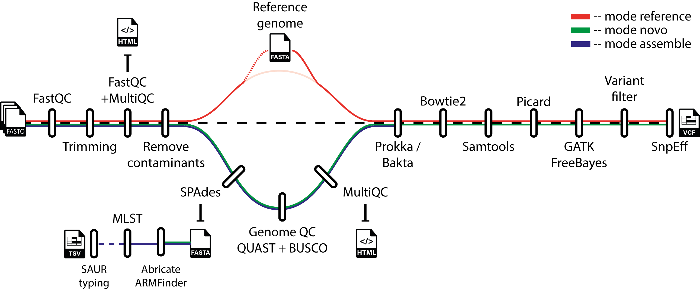

# WGS-Analysis-VariantCalling
[![Contributors][contributors-shield]][contributors-url]
[![Forks][forks-shield]][forks-url]
[![Stargazers][stars-shield]][stars-url]
[![Issues][issues-shield]][issues-url]
[![license-shield]][license-url]

## Introduction
This repository contains Nextflow-based pipeline for whole-genome sequencing (WGS) data analysis and genetic variant calling, specifically optimized for short-read **Illumina sequencing** data from bacterial genomes. It is designed to provide an automated, reproducible, and scalable solution for processing large-scale genomic data in clinical microbiology research.





## Contents
- [Pipeline summary](#pipeline-summary)
    - [Reference genome](#mode---reference--mode---novo)
    - [*De-novo*](#mode---reference--mode---novo)
    - [Genome assembly](#mode---assemble)
- [Installation](#installation)
- [How to Use It](#how-to-use-it)
    - [Usage and Parameters](#usage-and-parameters)
- [Output](#output)
- [References](#reference)


## Pipeline summary:

All modes in the pipeline include the following steps:

1. **Reads Quality Control and trimming**: Quality of raw sequencing data is assessed using [FastQC](https://www.bioinformatics.babraham.ac.uk/projects/fastqc/). Low-quality bases and adapter sequences are removed with [FastP](https://github.com/OpenGene/fastp), followed by another round of [FastQC](https://www.bioinformatics.babraham.ac.uk/projects/fastqc/). A summary of all QC reports is generated with [MultiQC](https://github.com/MultiQC/MultiQC).

2. **Contaminant sequence removal**: The taxonomic sequence classifier [Kraken2](https://github.com/DerrickWood/kraken2) is used to identify contaminant non-bacterial reads followed by [SEQTK](https://github.com/lh3/seqtk) to filter out all reads flagged as contaminants.

At this stage, the pipeline offers three modes, which differ based on the expected output —**Variant Calling** or **Genome Assembly**—, and the type of input data:
- For **Variant Calling**, the analysis can be performed using either:
    -  a [*de novo*](#mode---reference--mode---novo) assembled reference strain (--mode novo) or,
    - an existing [reference genome](#mode---reference--mode---novo) (--mode reference). 
- A shorter version of the pipeline is available to only perform [genome assembly](#mode---assemble) (--mode assemble). 
___

In both **genome assembly** (--mode assemble) and ***de novo* Variant Calling** (--mode novo), raw reads are initially assembled into a genome following the following steps:

1. **Assembly**: Filtered reads are *de novo* assembled using [SPAdes](https://github.com/ablab/spades).
2. **Genome QC**: Structural quality metrics are evaluated with [QUAST](https://quast.sourceforge.net/), and genome completeness is assessed using [BUSCO](https://busco.ezlab.org/). A final combined report is generated with [MultiQC](https://github.com/MultiQC/MultiQC).
3.   **Annotation**:  Genome annotation is performed using both [Prokka](https://github.com/tseemann/prokka) and [Bakta](https://github.com/oschwengers/bakta). The resulting GFF annotation files from both annotation tools are cleaned and combined.
4. **Mass screening of contigs for antimicrobial resistance and virulence genes** using [ABRIcate](https://github.com/tseemann/abricate) and **identification of antimicrobial resistance genes and point mutations** in protein and/or assembled nucleotide sequences using [AMRFinder](https://github.com/ncbi/amr).
---
After the assembly process, the Variant Calling analysis and the genome assembly mode diverge in their subsequent steps.

### mode --reference & mode --novo
 ***Reference and De-novo Variant Calling***    
Once a reference genome is provided —either *de novo* assembled or an existing reference— the pipeline follows the same steps for both modes:

1. **Alignment**: Reads are aligned to the selected reference genome using [Bowtie2](https://github.com/BenLangmead/bowtie2), and the resulting alignments are then processed with [Samtools](https://github.com/samtools/samtools).
2. **Variant calling and filtering**: Several steps are performed to identify, filter and annotate genomic variants.
     * **Variant Identification**: Detection of single nucleotide polymorphisms (SNPs) and insertions/deletions (indels) using [PicardTools](https://broadinstitute.github.io/picard/), [GATK](https://github.com/broadinstitute/gatk) and/or [FreeBayes](https://github.com/freebayes/freebayes).
    *  **Variant Filtering**: Filters are applied to obtain high-confidence variant calls ([*see Parameters*](#parameters)).
    *  **Genetic variant annotation**: The toolbox [SnpEff](http://pcingola.github.io/SnpEff/) is used to annotate and predict the functional effects of genetic variants on genes and proteins.

### mode --assemble

 ***Genome Assembly***    
For the --mode assemble, a simplified pipeline is executed:
 * MLST analysis: 
    - A fast MLST analysis is performed using raw FASTQ reads with [ARIBA](https://github.com/sanger-pathogens/ariba) 
    - A "slow" MLST analysis is performed on the assembled genome using [MLST](https://github.com/tseemann/mlst). 
 * *Staphylococcus aureus*: In case --mrsa parameter is added in the command line, the [spaTyper](https://github.com/HCGB-IGTP/spaTyper) and [sccmec](https://github.com/rpetit3/sccmec) tools are used to identifying the spa type and the SCCmec cassettes.

 >[!NOTE] 
 The pipeline includes an script to download the reads from DB using an Acc_List.txt<br>
    ```
    bash ./workflow/bin/download_reads.sh
    ```
## Installation
Prerequisites to run the pipeline:
- Install [Nextflow](https://github.com/nextflow-io/nextflow) (Ver. ≥ 25.10.0).
- Install [Docker](https://github.com/docker/docker-install) or [Singularity](https://github.com/sylabs/singularity-admindocs/blob/main/installation.rst) for container support.
- Ensure [Java 8](https://github.com/winterbe/java8-tutorial) or a later version is installed.

Clone the Repository:

```
# Clone the workflow repository
git clone https://github.com/AMRmicrobiology/WGS-Analysis-VariantCalling.git

# Move inside the main directory
cd WGS-Analysis-VariantCalling
```
### Local (Singularity)
If you are running the pipeline locally, remember to define the path for Singularity temporary files and cache:
 ```
SINGULARITY_TMPDIR=/PATH/singularity/tmp
SINGULARITY_CACHEDIR=/PATH/singularity/cache
TMPDIR=/PATH/singularity/tmp
export NFX_SINGULARITY_CACHEDIR =/PATH/singularity/tmp
```
>[!NOTE]
Conda environments are listed and created but have not been tested.

## How to use it?

Run the pipeline using the following commands, adjusting the parameters as needed:

*REFERENCE GENOME VARIANT CALLING*
```
nextflow run main.nf --mode reference --input "/path/to/data/*_{1,2}.fastq.gz" --personal_ref "/path/to/bacterial_genome.fasta" --genome_name_db "Acinetobacter_baumanii_clinical" -profile <docker/singularity/conda>
```

*DE NOVO VARIANT CALLING*

```
nextflow run main.nf --mode novo --input "/path/to/data/*_{1,2}.fastq.gz" --wildtype_code "Pa01WT" --genome_name_db "Acinetobacter_baumanii_clinical" -profile <docker/singularity/conda>
```

*GENOME ASSEMBLY*
```
nextflow run main.nf --mode assemble --input "/path/to/data/*_{1,2}.fastq.gz" --organism "organism name" -profile <docker/singularity/conda>
```

### Usage and parameters
```bash
Usage: nextflow run main.nf [--help] [--mode VAR] [--input VAR] [--genome_name_db VAR] [--wildtype_code VAR] [--outdir VAR] [--personal_ref VAR] [--custom_gff3 VAR] [--organism VAR] [--cut_front VAR] [--cut_tail VAR] [--cut_mean_quality VAR] [--length_required VAR] [--mrsa] -[-qual_snp VAR] [--qual_indel VAR] [--bakta_db_define VAR] [--db_select VAR] [--abricate_db VAR] [-w VAR] [-profile VAR]

Input data arguments
  --mode                TEXT        Selection of the pipeline assemble/reference/novo [required]
  --input               PATH        Input FASTQ paired-end files named *_{1,2} (.fastq.gz format) [required]
  --genome_name_db      TEXT        (--mode novo/reference) Name of the organism/strain to name the SnpEFF database [required]
  --wildtype_code       TEXT        (--mode novo) Define the sample that will be taken as reference [required]
  --personal_ref        PATH        (--mode reference) Path to the bacterial reference genome in .fasta file [required]
  --custom_gff3         PATH        (--mode reference) Path to the annotation .GGF3 file.

Nextflow arguments
  -profile              TEXT        Selection of execution profile (docker, singularity or conda) [required]
  -w                    PATH        Path to the work dir. where temporary files will be written [default: ./work ]

Output arguments
  --outdir              PATH        Directory to write the output [default: ./out]

Optional arguments 
  --help                            Show this message and exit      
  --mrsa                BOOLEAN     (--mode assemble) Specific for <Staphylococcus aureus> genome assemblies. Add this parameter to identify the spa Type and SCCmec cassettes [dafault: false]

Raw reads filtering arguments
  --cut_front           INTEGER     Move a sliding window from front (5') to tail, drop the bases in the window if its mean quality < threshold, stop otherwise. [default: 15]
  --cut_tail            INTEGER     Move a sliding window from tail (3') to front, drop the bases in the window if its mean quality < threshold, stop otherwise [default: 20]
  --cut_mean_quality    INTEGER     The mean quality requirement option shared by cut_front, cut_tail or cut_sliding. Range: 1~36. [default: 20]
  --length_required     INTEGER     Reads shorter than length_required will be discarded [default: 50]

Filtering parameters
  --snp_filter_expr     TEXT        One or more expressions used with INFO fields to quality filter SNPs [default "QUAL < 50.0 || MQ < 25.0 || DP < 30"].
  --indel_filter_expr   TEXT        One or more expressions used with INFO fields to quality filter INDELs [default: "QUAL < 200.0 || MQ < 25.0 || DP < 30"]

MLST and AMR arguments
  --organism            TEXT        To be used by ARIBA to determine the scheme to classify the [bacterial strain](./organisms_list.txt). Also, it will be used by ABRicate. ABRicate searches the following databases: vfdb_full, resfinder, plasmidfinder, and card. If Escherichia coli or Klebsiella pneumoniae is specified, ecoli_vf and argannot will be searched, respectively, instead of vfdb_full [default: ""] [required for mode --assemble] 

Databases arguments
  --bakta_db         PATH        Define the path to the user downloaded database to be used by Bakta. By default the database is downloaded if no argument is added. Another option is to copy-paste the database directly to the "./bakta_db" directory
  --db_select        TEXT/PATH   Kraken2 database to use for taxonomy classification. The options "db_16GB" or "db_full_60GB" are downloaded automatically if specified. Alternatively, a path to a user-provided database may be supplied. Another option is to copy-paste the database directly into the "./kraken_db" directory [default: "db_16GB"]
  --abricate_db      PATH        Path to the user downloaded databases to be used by Abricate
 
```
>[!NOTE]
Regarding GATK quality parameters --> QUAL: A confidence measure of the variant; MQ: Mapping quality; DP: Filtered reads that support each of the reported alleles (depth). More info [here](https://gatk.broadinstitute.org/hc/en-us/articles/360035890471-Hard-filtering-germline-short-variants).

## Output
This is the folder architecture and the content of the output data directories. Outputs can vary depending on the mode selected:

<div style="overflow-x: auto;">

<table>
    <thead>
        <tr>
            <th align="center">Folder</th>
            <th align="center">Subfolder</th>
            <th align="center">Description</th>
        </tr>
    </thead>
    <tbody>
        <tr>
            <td rowspan="1" align="center"><nobr>1-QC</td>
            <td align="center"><nobr>fastQC</td>
            <td align="center">MultiQC report of data quality assessment of all samples</td>
        </tr>
        <tr>
            <td rowspan="2" align="center"><nobr>2-Assembly</td>
            <td align="center"></td>
            <td align="center">All final consensus genomes assemblies</td>
        </tr>
        <tr>
            <td align="center"><nobr>3-Annotations</td>
            <td align="center">Bakta and Prokka output directories. Also, the combined annotation files</td>
        </tr>
        <tr>
            <td rowspan="2" align="center"><nobr>3-AMR</td>
            <td align="center">ABRICATE</td>
            <td align="center">ABRICATE search results</td>
        </tr>
        <tr>
            <td align="center">AMRFinder</td>
            <td align="center">AMRFinder search results</td>
        </tr>
        <tr>
            <td align="center"><nobr>3-prunning</td>
            <td align="center"></td>
            <td align="center">Pruning reports</td>
        </tr>
        <tr>
            <td align="center"><nobr>4-VCF</td>
            <td align="center"></td>
            <td align="center">VCF results before annotation</td>
        </tr>
        <tr>
            <td align="center"><nobr>Variant_annotations</td>
            <td align="center"></td>
            <td align="center">Annotated VCFs</td>
        </tr>
        <tr>
            <td align="center"><nobr>Variant_annotations_enriched</td>
            <td align="center"></td>
            <td align="center">Annotated VCFs with more information and curated files</td>
        </tr>
    </tbody>
</table>

</div>

## Reference:

[In Silico Evaluation of Variant Calling Methods for Bacterial Whole-Genome Sequencing Assays](https://www.ncbi.nlm.nih.gov/pmc/articles/PMC10446864/)

[Recommendations for clinical interpretation of variants found in non-coding regions of the genome](https://www.ncbi.nlm.nih.gov/pmc/articles/PMC9295495/)

[An ANI gap within bacterial species that advances the definitions of intra-species units](https://journals.asm.org/doi/10.1128/mbio.02696-23)

[Evaluation of serverless computing for scalable execution of a joint variant calling workflow](https://journals.plos.org/plosone/article?id=10.1371/journal.pone.0254363)

[GATK hard filtering: tunable parameters to improve variant calling for next generation sequencing targeted gene panel data](https://bmcbioinformatics.biomedcentral.com/articles/10.1186/s12859-017-1537-8#Sec6)

[Assembling the perfect bacterial genome using oxford nanopore and illumina sequencing](https://pubmed.ncbi.nlm.nih.gov/36862631/)


<!-- ADD REFERENCES -->

[contributors-shield]: https://img.shields.io/github/contributors/jimmlucas/DIvergenceTimes.svg?style=for-the-badge
[contributors-url]: https://github.com/AMRmicrobiology/WGS-Analysis-VariantCalling/graphs/contributors

[forks-shield]: https://img.shields.io/github/forks/jimmlucas/DIvergenceTimes.svg?style=for-the-badge
[forks-url]: https://github.com/AMRmicrobiology/WGS-Analysis-VariantCalling/branches

[stars-shield]: https://img.shields.io/github/stars/jimmlucas/DIvergenceTimes.svg?style=for-the-badge
[stars-url]: https://github.com/AMRmicrobiology/WGS-Analysis-VariantCalling/stargazers

[issues-shield]: https://img.shields.io/github/issues/jimmlucas/DIvergenceTimes.svg?style=for-the-badge
[issues-url]: https://github.com/AMRmicrobiology/WGS-Analysis-VariantCalling/issues

[license-shield]: https://img.shields.io/github/license/jimmlucas/DIvergenceTimes.svg?style=for-the-badge
[license-url]: https://github.com/AMRmicrobiology/WGS-Analysis-VariantCalling/blob/structural-edit/LICENSE


